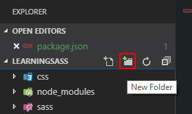

# [Learningsass](https://devang-atliq.github.io/Learningsass/)

Packge.json file script setup and step basice project 

#All Step
1.npm init --yes
2.npm install sass --save-dev
3.npm install

#First Sass/SCSS script

#Simple project structure

#Compiling Sass/SCSS scripts
sass source_script.sass compiled_css_file.css
sass sass/main.scss css/style.css
sass sass/main.sass css/style.css

#NPM custom tasks (scripts)

#Live server & parallel tasks
npm i @compodoc/live-server --save-dev
npm install npm-run-all --save-dev

